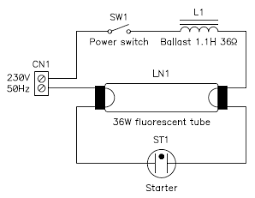
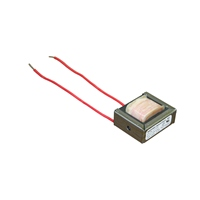

# Transformers
I took the transformer core from an old fluorescent tube ballast circuit.

It's not a transformer per se, it's rather a simple inductor.

The measured resistance of 10ft enameled wire is 0.64Ω. 
The measured diameter is Ø0.33mm ~ 28AWG
    
spec:
*    diameter: Ø0.321mm
*    resistance: 64.9Ω per 1000ft
*    max current: 1.4 A
*    max freq for 100% skin depth: 170 kHz

# References
* https://ludens.cl/Electron/Magnet.html
* https://www.homemade-circuits.com/how-to-make-transformers
* https://kaizerpowerelectronics.dk/theory/wire-size-table/
* http://hyperphysics.phy-astr.gsu.edu/hbase/Tables/wirega.html
* 
